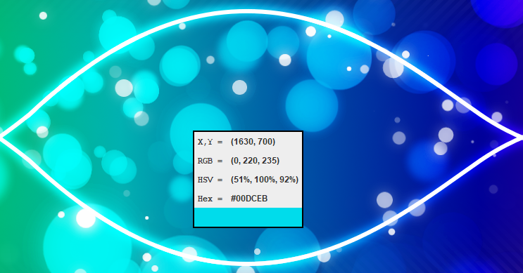

# PixelDetails

  
  
  

This project allows you to see the details of a pixel at the current location of the mouse pointer. The current build provides mouse pointer coordinates, RGB values, HSV values, Hex values, and a panel for you to view the pixel color in a larger area.

## Prerequisites

### Languages
* [Java](https://go.java/index.html?intcmp=gojava-banner-java-com)

### Libraries
* No additional libraries

## Getting Started

The minimum version requirements for each additional software are listed in the badges at the top of the readme.
It is recommended that you install the most updated version at your time of installation.

### Installing Java

Visit the <a href="http://www.oracle.com/technetwork/java/javase/downloads/index.html">Java Downloads</a> 
page and select the version of your choice.
Run the installer and follow the instructions provided.

## License
This project is licensed under the MIT License - see the [LICENSE.md](LICENSE.md) file for details
